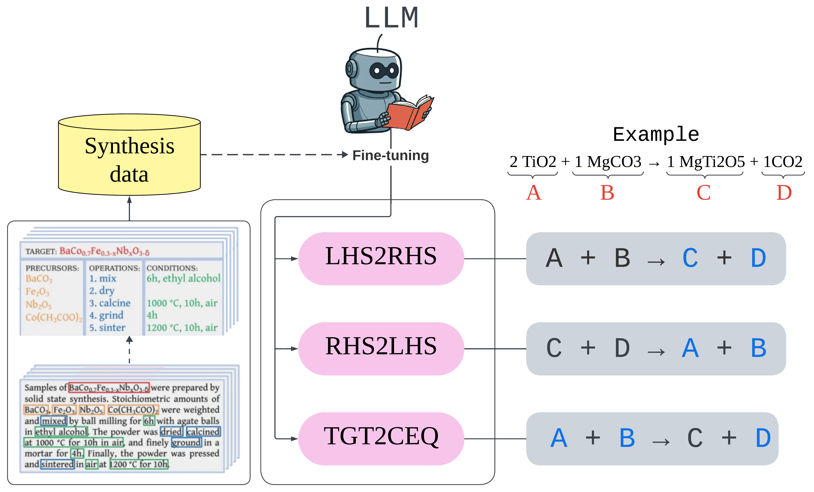

# LLM4Mat

**LLM4Mat** is a framework that leverages large language models (LLMs) to predict chemical synthesis pathways for inorganic materials. It includes three core models: 
1. **LHS2RHS**: Predicts products from reactants.
2. **RHS2LHS**: Predicts reactants from products.
3. **TGT2CEQ**: Generates the full chemical equation given a target compound.

These models are fine-tuned using a text-mined synthesis database, improving prediction accuracy from under 40% to around 90%. The framework also introduces a generalized Tanimoto similarity for accurate evaluation of chemical equations.

<p align="center">
  
</p>

---

## Table of Contents

1. [Folder Structure](#folder-structure)
2. [Download Dataset](#download-dataset)
3. [Set Up Hugging Face and WandB Accounts](#set-up-hugging-face-and-wandb-accounts)
   - [Hugging Face](#hugging-face)
   - [WandB](#wandb)
4. [Environment Setup](#environment-setup)
5. [Training the Model](#training-the-model)
6. [Testing the Model](#testing-the-model)
7. [Available Models](#available-models)
8. [Evaluate Generated Equations](#evaluate-generated-equations)
9. [References](#references)
10. [Citation](#citation)

---

## Folder Structure

1. Create the following folders for data and models:
    ```
    ./data/  
    ./models/  
    ```

## Download Dataset

Download the dataset from the following sources and place the `.json` files in `./data/`:

- [Nature Scientific Data](https://www.nature.com/articles/s41597-019-0224-1)

## Set Up Hugging Face and WandB Accounts

### Hugging Face
1. Sign up at [Hugging Face](https://huggingface.co/).
2. Generate API keys for "Writing" and "Reading".
3. Duplicate `env_config_template.py` and rename it to `env_config.py`.
4. Paste your Hugging Face API keys (`hf_api_key_r`, `hf_api_key_w`) and Username (`hf_usn`) in `env_config.py`.
5. Set the path to the `.json` data file as `data_path` in `env_config.py`.

### WandB
1. Sign up at [WandB](https://wandb.ai/site).
2. Login to WandB from the terminal using `wandb login`.

## Environment Setup

Ensure that the following libraries are installed:

```bash
Python==3.10.0   
torch==2.0.0+cu118    
transformers==4.33.2     
wandb==0.16.0   
accelerate==0.3.0   
huggingface_hub==0.16.4   
datasets==2.14.5   
# Other basic libraries like numpy, matplotlib, etc.
```

## Training the Model

Choose a task from the following options: `['lhs2rhs', 'rhs2lhs', 'lhsope2rhs', 'rhsope2lhs', 'tgt2ceq', 'tgtope2ceq']`.

If needed, set `ver_tag`. Then, run the training script:

```bash
python train_llm4syn.py
```

## Testing the Model

To test a trained model, set the `task`, `model_tag`, and `ver_tag` to match the trained model saved on HuggingFace. Then, run:

```bash
python test_llm4syn.py
```

## Available Models

| Model Name                                | Pre-trained Model | Task Description                       | Link |
| ----------------------------------------- | ----------------- | -------------------------------------- | ---- |
| RyotaroOKabe/lhs2rhs_dgpt2_v1.2.1         | distilgpt2        | Predict RHS given LHS                  | [Link](https://huggingface.co/RyotaroOKabe/lhs2rhs_dgpt2_v1.2.1) |
| RyotaroOKabe/rhs2lhs_dgpt2_v1.2.1         | distilgpt2        | Predict LHS given RHS                  | [Link](https://huggingface.co/RyotaroOKabe/rhs2lhs_dgpt2_v1.2.1) |
| RyotaroOKabe/tgt2ceq_dgpt2_v1.2.1         | distilgpt2        | Predict CEQ given TGT                  | [Link](https://huggingface.co/RyotaroOKabe/tgt2ceq_dgpt2_v1.2.1) |
| RyotaroOKabe/lhsope2rhs_dgpt2_v1.2.1      | distilgpt2        | Predict RHS given LHS with additional OPE | [Link](https://huggingface.co/RyotaroOKabe/lhsope2rhs_dgpt2_v1.2.1) |
| RyotaroOKabe/rhsope2lhs_dgpt2_v1.2.1      | distilgpt2        | Predict LHS given RHS with additional OPE | [Link](https://huggingface.co/RyotaroOKabe/rhsope2lhs_dgpt2_v1.2.1) |
| RyotaroOKabe/tgtope2ceq_dgpt2_v1.2.1      | distilgpt2        | Predict CEQ given TGT with additional OPE | [Link](https://huggingface.co/RyotaroOKabe/tgtope2ceq_dgpt2_v1.2.1) |

## Evaluate Generated Equations

To evaluate the model-generated equations, run:

```bash
eval_llm4syn.ipynb  
```

## References

```bibtex
[1] 
@article{kononova2019text,
  title={Text-mined dataset of inorganic materials synthesis recipes},
  author={Kononova, Olga and Huo, Haoyan and He, Tanjin and Rong, Ziqin and Botari, Tiago and Sun, Wenhao and Tshitoyan, Vahe and Ceder, Gerbrand},
  journal={Scientific data},
  volume={6},
  number={1},
  pages={203},
  year={2019},
  publisher={Nature Publishing Group UK London}
}
```

## Citation

If you find this code or dataset useful, please cite the following paper:

```bibtex
@article{okabe2024virtual,
  title={Virtual node graph neural network for full phonon prediction},
  author={Okabe, Ryotaro and others},
  journal={XXXX},
  pages={XXX},
  year={2024},
  publisher={XXX}
}
```
